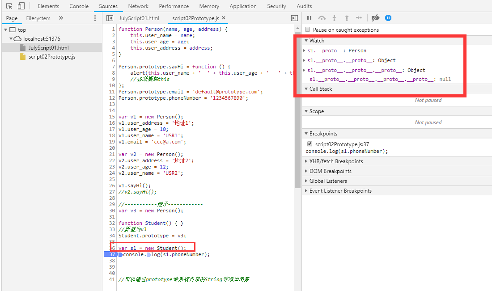

# JavaScript Learning Note

### 预解析问题：
```javascript
var user_name='steve';

function f1(){
    alert(user_name);
    var user_name='yzk';
    alert(user_name);
}

f1();
alert(user_name);
//结果：
//Undefine->yzk->steve
//原因：
//在f1函数中，预解析变量user_name，所以第一次alert出来是undefined，而第二次是yzk。第三次alert出来的是当前块的user_name，所以是steve
```
> 一般会在头部提前声明要使用的变量

```javascript
//匿名函数
//  1.不写函数名
var f1=function(){alert('hi');};
//  2.定义的同时直接调用
(function (x,y){alert(x+y);})(10,50);
//  3.使用Eval或者new Function
//      推荐使用new Function.Eval中的变量外部可访问到
var f1=new Function('x,y,z','alert(x+y+z);');
f1(1,2,3);
```

### 原型理解笔记Prototype


> 给系统类型注册原型

> 

### 继承



### 动态注册事件

> 尽量多使用匿名函数
> 尽量使用动态注册事件

```html
<input type="button" id="onbtn" value="动态注册事件"/>
```

```javascript
window.onload = function () {
    //document.getElementById('btn').value = 'aaa';
    document.getElementById('onbtn').onclick = function () {
        //打印Date的正确方式
        alert(new Date().toLocaleDateString());
    };
}
```
``` xxx.onclick=fnClick;``` 与 ```xxx.onclick=fnClick();``` 的区别在于
> fnClick是赋值事件，fuClick()是赋值```函数处理后return```的结果(一般为undefined)

### SetInterval使用定时器

HTML代码：
```html
<input type="text" id="txt" value="0">
<input type="button" id="intervalStart" value="计时开始" />
<input type="button" id="intervalStop" value="计时结束" />
```

定时器使用代码：
```js
window.onload = function () {
    var timerId;
    //document.getElementById('btn').value = 'aaa';
    //找到btn 绑定开始事件
    document.getElementById('intervalStart').onclick = function () {
        //开始计时
        timerId = setInterval(function () {
            //++
            document.getElementById('txt').value++;
        }, 500);
        console.log(timerId);
    };
    document.getElementById('intervalStop').onclick = function () {
        //停止计时
        window.clearInterval(timerId);
        console.log(timerId);
    };
}
```

在使用时遇到一个问题：


当多次点击“计时开始”按钮时，“计时结束”按钮无法结束计时，并且计时速度明显增快，多点一次就更快一点。

为调查原因，使用了Console.log打印出TimerId。发现，clearInterval指定的id为7时才能停止Timer。


### 星星评价是怎么做的

```javascript
<script type="text/javascript">
    //星星评价：
    window.onload = function ()
    {
        //获取所有td
        var tds = document.getElementsByTagName('td');
        for (var i = 0; i < tds.length; i++) 
        {
            tds[i].onmouseover = function () 
            {
                for (var j = 0; j < tds.length; j++) {
                    tds[j].style.backgroundImage = "url('src/star2.png')";
                    if (tds[j] === this) {
                        break;
                    }
                }
            };
            tds[i].onmouseout = function ()
            {
                
                for (var j = 0; j < tds.length; j++)
                {
                    tds[j].style.backgroundImage = "url('src/star.png')";
                    if (tds[j] === this)
                    {
                        break;
                    }
                }
            };
            tds[i].onclick = function ()
            {
                for (var j = 0; j < tds.length; j++)
                {
                        tds[j].removeAttribute('isclicked');
                }
                this.setAttribute('isclicked', 'isclicked');
            };
        }//for循环
    };
</script>
```

其中```tds[j].style.backgroundImage = "url('src/star.png')";``` “”代表中间是个函数，而‘’代表Content（内容）

#### 效果：


### jQuery选择器及dom对象转换

* dom对象转换：

```js
//jq对象对浏览器的兼容性更好
//dom to jQuery:
$(dom)

//jquery to dom
var dom=$jqueryObject[0];
var dom=$icueryobject get(0);
```

* jQuery设置P标签
```js
<script src="jquery-3.3.1.js"></script>
<script type="text/javascript">
$(function () 
{
    $('p').css(
        {
            width: '90px',
            backgroundColor:'Red'
        });
}
);
</script>
```

* jQuery设置类样式表（class）
 ```js
 $(function () {
$('.xxx').css(
    {
        border: '10px solid blue'
    });
});
```
* 通过id改变div
```js
$(function () 
{
    $('#div1').text('hello');
});
```

* 星星评价更简洁的写法

```js
//如果需要做到前面一样的变色，可以使用prevAll与end.nextAll
$(function () 
{
    $('p').mouseover(function () 
    {
        $(this).css(
            {
                width: '90px',
                backgroundColor: 'Red'
            }).siblings.css(
                {
                    backgroundColor: 'Yellow'
                });
    });
    $('p').mouseout(function()
    {
        $(this).css({
            backgroundColor: ''
        });
    });

}//$func
);
```
* 还有更多的选择器


* 层次选择器

```js
//div下的所有p标签
$('div p').css({border:'10px blue'});
//选取body下的直接子元素 body中div中的p不会被选取（中间注意有空格）
$('body > p').css({border:'10px blue'});

```
